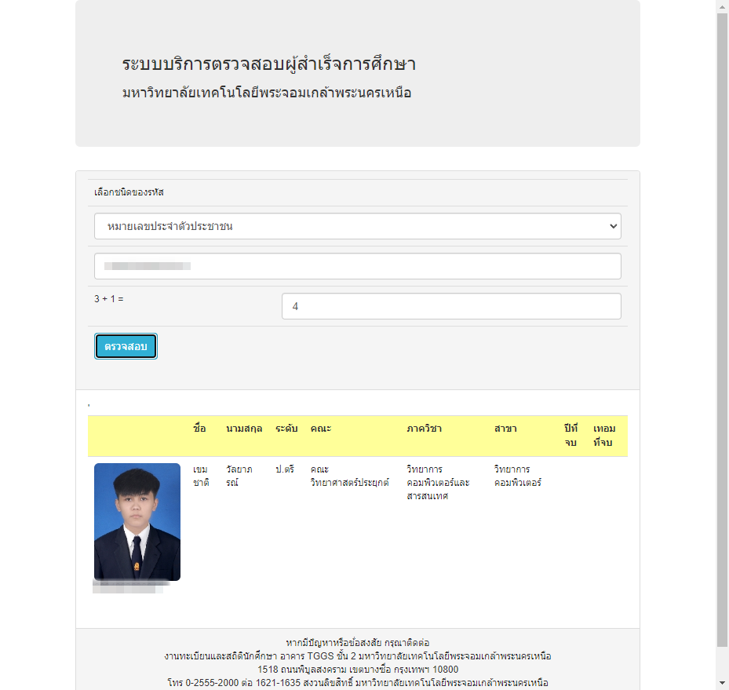

# Automated Graduation Examination Verification System (KMUTNB) using Selenium

This Python code automates the process of verifying graduation examination results on the Graduation Examination Verification System at KMUTNB (King Mongkut's University of Technology North Bangkok). It utilizes the Selenium library to interact with the system's web interface.

## Prerequisites
- Python
- Selenium library
- Chrome WebDriver

## Setup Instructions
1. Install the required dependencies mentioned above.
2. Clone this repository to your local machine.

## Usage Instructions
1. Open the code file in a Python-compatible IDE or text editor.
2. Modify the `stdKey` variable with the appropriate id key.
3. Set the `directory_path` variable to the desired directory where you want to save the screenshot.
4. Run the code.

## Example Screenshot

## Description
The code automates the following steps:
1. Launches a Chrome WebDriver and navigates to the Graduation Examination Verification System's website.
2. Waits for the page to load.
3. Enters the student key into the corresponding form field.
4. Reads the randomly generated mathematical question from the web page.
5. Extracts the numbers from the question and calculates the answer.
6. Enters the calculated answer into the form field.
7. Submits the answer by clicking the submit button.
8. Pauses for a short duration.
9. Captures a screenshot of the page and saves it to the specified directory.
10. Closes the browser and terminates the WebDriver.
11. Prints the calculated answer.

## Contributing
Contributions to this project are welcome. Feel free to open issues and submit pull requests to suggest improvements, add features, or fix bugs.

## License
This project is licensed under the [MIT License](LICENSE).
